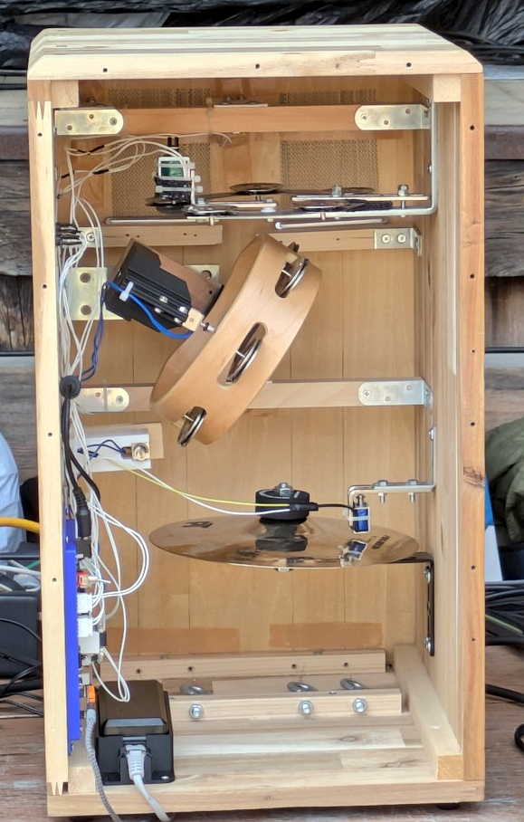

# All-in Cajon "Pokorinta"

## English

### Overview
This repository contains the program for All-in Cajon "Pokorinta" exhibited at NT Kyoto 2025.

- All-in Cajon "Pokorinta" is an automatic rhythm machine shaped like a cajon. Inside the body are instruments such as tambourines and cymbals, which are rhythmically struck by seven solenoids to create pleasant rhythms.
  - The circuit and program can drive up to 8 solenoids, but only 7 are actually installed in Pokorinta.
- Pressing the button attached to the main unit starts the performance.
- Performance data uses MIDI files stored on an SD card. The data from the drum channel (9) is read, and each drum instrument is mapped to the solenoids of Pokorinta for playback.

**Demo Video:**  
[Playing 'Senbonzakura' on Pokorinta Cajon @NT Kyoto 2025](https://youtu.be/M3PQvyEZkvs?si=6jQbiOPsckav4VGM)

**Circuit diagram:**  
[pokorinta_circuit.pdf](pokorinta_circuit.pdf)
- Microcontroller board: M5Stamp S3

### Development Environment
- IDE: Arduino IDE
- Board: M5Stack by M5Stack official v.2.1.3
- Libraries:
  - Adafruit BusIO by Adafruit v.1.17.0
  - RTClib by Adafruit v.2.1.4
  - SdFat by Bill Greiman v.2.3.0

---

## 日本語

### 概要
本リポジトリは、NT京都2025で展示した All-in Cajon "Pokorinta" のプログラムを格納しています。

- All-in Cajon "Pokorinta" はカホンの見た目をした自動演奏リズムマシンです。筐体の内部にはタンバリンやシンバルなどの楽器が入っており、それらを7個のソレノイドでリズミカルに叩いて心地よいリズムを奏でます。
  - なお、基板やプログラムとしては8chのソレノイド出力が可能です。
- 本体のボタンを押すことで演奏が開始されます。
- 演奏データはSDカードに保存されたMIDIファイルを使用します。ドラムチャネル(9)のデータを読み込み、ドラムの各楽器をPokorintaのソレノイドにマッピングし、演奏を行います。

**デモ動画:**  
[自動演奏カホン「Pokorinta」で『千本桜』を叩いてみた！@NT京都2025](https://youtu.be/M3PQvyEZkvs?si=6jQbiOPsckav4VGM)

**回路図:**  
[pokorinta_circuit.pdf](pokorinta_circuit.pdf)
- マイコンボード：M5Stamp S3

### 開発環境
- IDE：Arduino IDE
- ボード：M5Stack（M5Stack official v.2.1.3）
- ライブラリ：
  - Adafruit BusIO（Adafruit v.1.17.0）
  - RTClib（Adafruit v.2.1.4）
  - SdFat（Bill Greiman v.2.3.0）

